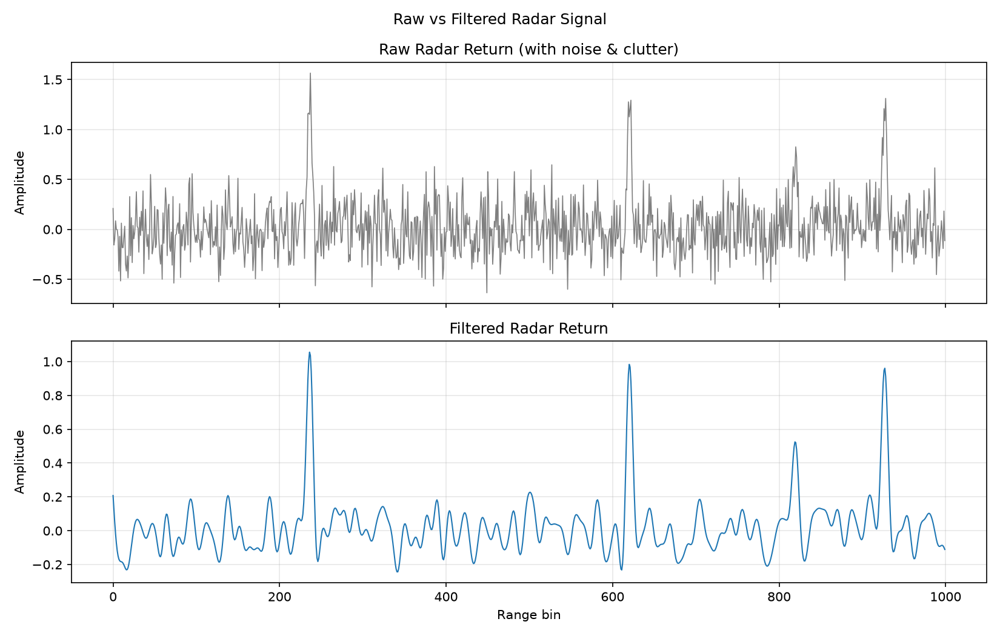
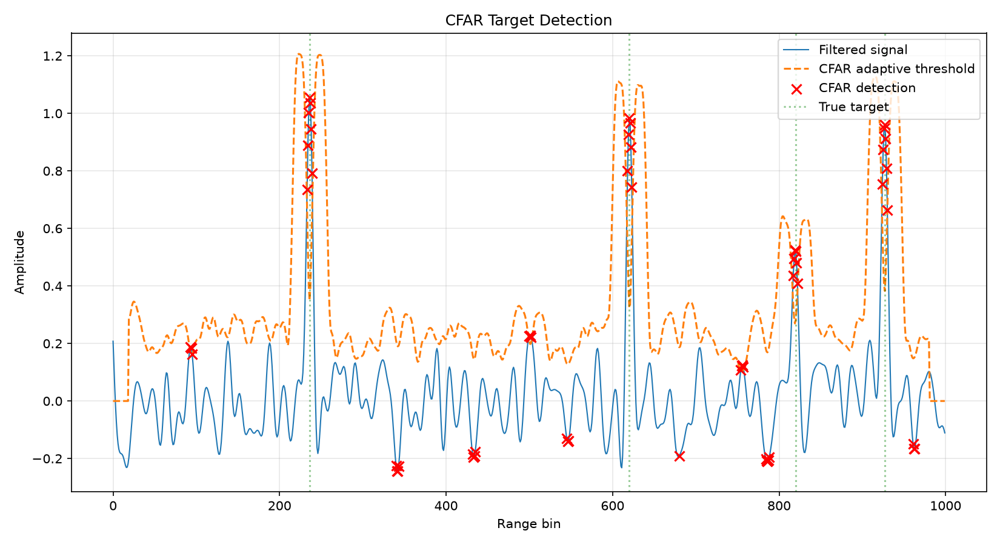
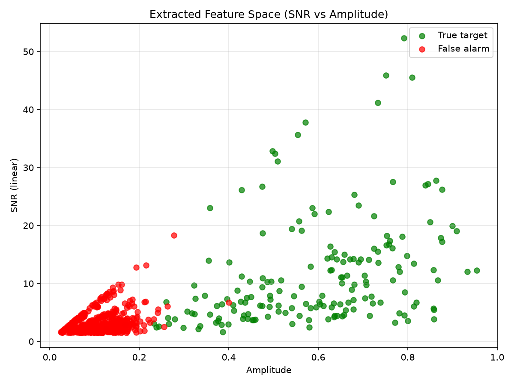
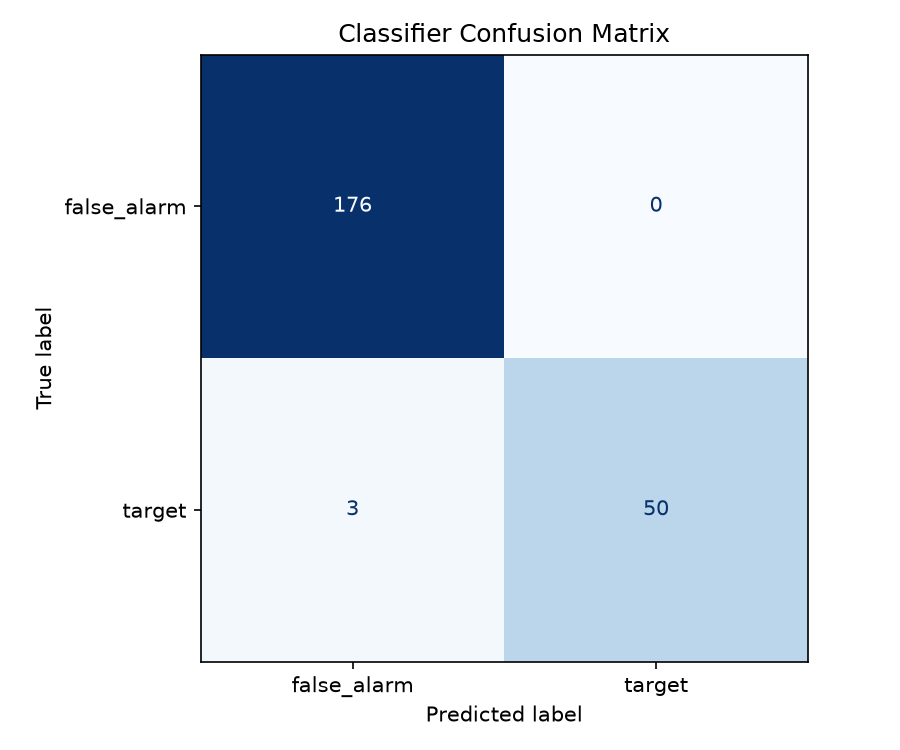
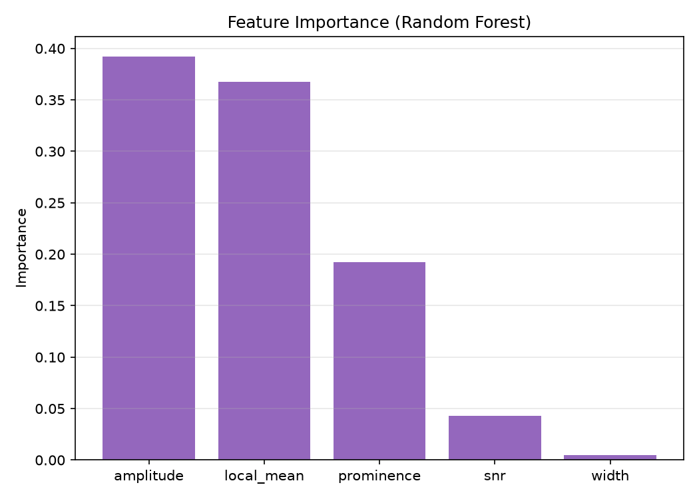

# 🎯 Radar Target Detection & Signal Analysis

[](https://radar-target-detection.streamlit.app/)
[](https://www.python.org/)
[](https://scikit-learn.org/)
[](https://streamlit.io/)

An end-to-end Python pipeline that simulates radar return signals, applies digital filtering for noise reduction, performs CFAR (Constant False Alarm Rate) target detection, and uses a machine learning classifier to separate true targets from false alarms.

**🔗 Live Demo:** [radar-target-detection.streamlit.app](https://radar-target-detection.streamlit.app/)

---

## Overview

This project simulates a real radar signal-processing pipeline — from raw noisy returns to classified target detections — combining a classical radar algorithm (CFAR detection) with a machine learning classifier for target identification.

## Features

- **Radar signal simulation** — synthetic range-profile generation with configurable targets, clutter, and noise
- **Digital filtering** — Butterworth low-pass, moving average, and matched filtering for noise reduction
- **CFAR detection** — industry-standard Constant False Alarm Rate target detection algorithm
- **Feature extraction** — amplitude, SNR, peak width, and prominence for each candidate detection
- **Machine learning classification** — Random Forest classifier trained to distinguish true targets from false alarms
- **Interactive web demo** — run the full pipeline and view results in-browser via Streamlit

## Tech Stack

| Category | Tools |
|---|---|
| Language | Python 3.11 |
| Signal Processing | NumPy, SciPy |
| Machine Learning | Scikit-learn |
| Visualization | Matplotlib |
| Data | Pandas |
| Web App | Streamlit |

## Sample Output

**Raw vs. Filtered Signal**


**CFAR Target Detection**


**Extracted Feature Space**


**Classifier Confusion Matrix**


**Feature Importance**


## Run Locally

```bash
git clone https://github.com/PranayPilli/radar-target-detection.git
cd radar-target-detection
python -m venv venv
source venv/bin/activate      # Windows: venv\Scripts\activate
pip install -r requirements.txt
python src/main.py
```

Or launch the interactive web app locally:

```bash
streamlit run app.py
```

## Project Structure

```
radar-target-detection/
├── src/
│   ├── signal_simulation.py     # Simulates radar returns (targets + clutter + noise)
│   ├── filtering.py              # Noise reduction / digital filters
│   ├── feature_extraction.py     # Peak detection & feature engineering
│   ├── detection.py              # CFAR detector + ML classifier
│   ├── visualization.py          # Plotting utilities
│   └── main.py                   # Full pipeline entry point
├── output/                       # Generated plots & CSV report
├── app.py                        # Streamlit web interface
├── requirements.txt
└── README.md
```

## Results

The trained classifier achieves **~99% accuracy** distinguishing true radar targets from clutter/noise false alarms on held-out test data, with a full precision/recall/F1 report generated on every run.

## Author

**Pranay Pilli**
Built as a demonstration of radar signal processing and applied machine learning for target detection.
